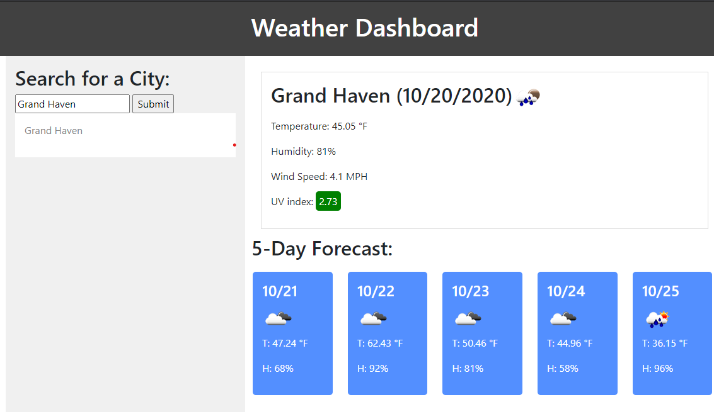

# 06-Server-Side-APIs-Weather-Dashboard
The objective of this project was to build a weather dashboard showing current and future weather for searched cities. 

## Project Requirments
This project needed to include; the use of the openweather API, current and 5-day weather data, persistent storage of past searches, persistent weather data on page load of last search, city name, date, weather icons, temperatures, humidities, color coded UV index, clickable past searches.  

## Viewing Project
This project can be viewed at https://sambishop3015.github.io/06-Server-Side-APIs-Weather-Dashboard/. 

## Github Repository
The repository for this project can be viewed at https://github.com/sambishop3015/06-Server-Side-APIs-Weather-Dashboard.

## Contributors
@sambishop3015

## Contact
If you want to contact me you can reach me at sambishop3015@hotmail.com

## License
This project uses the following license: none.

;